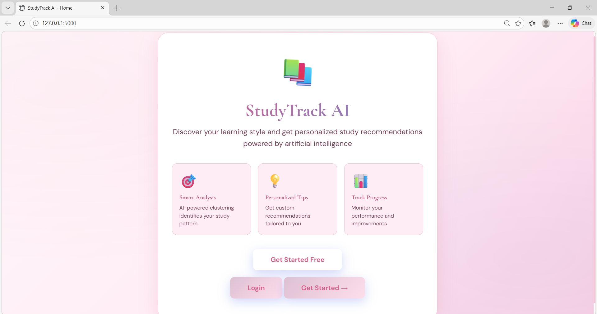
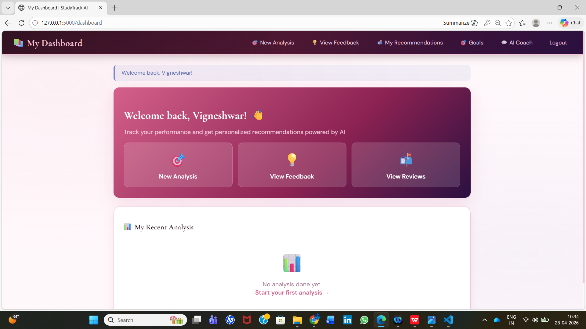
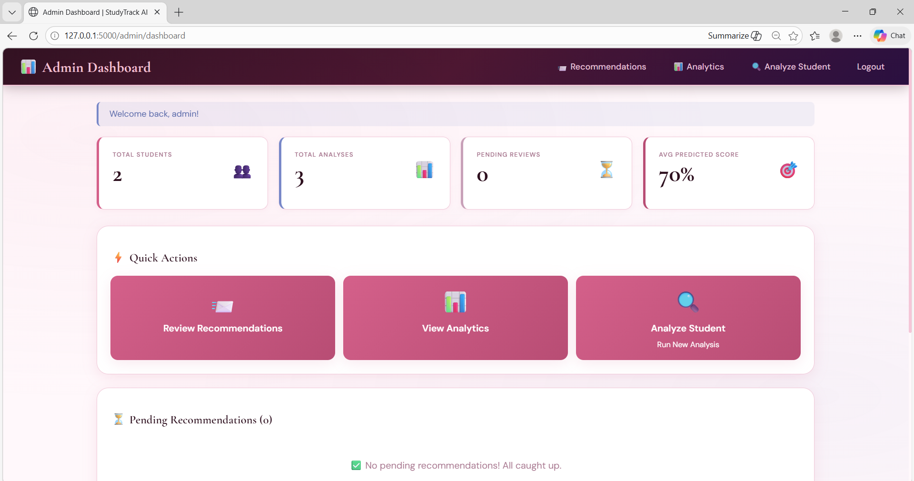
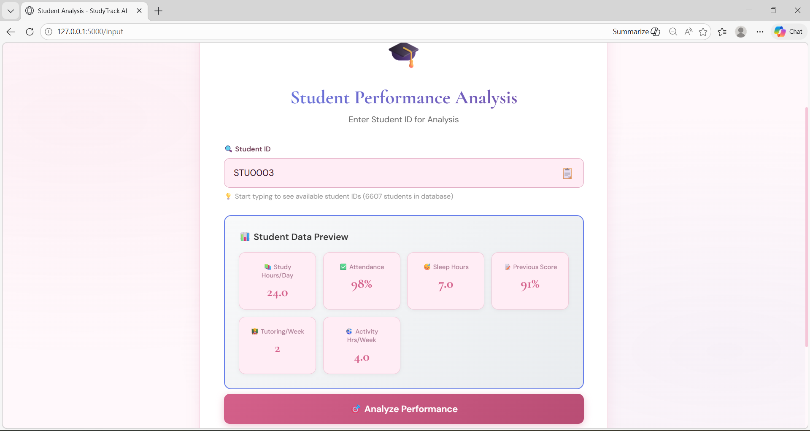
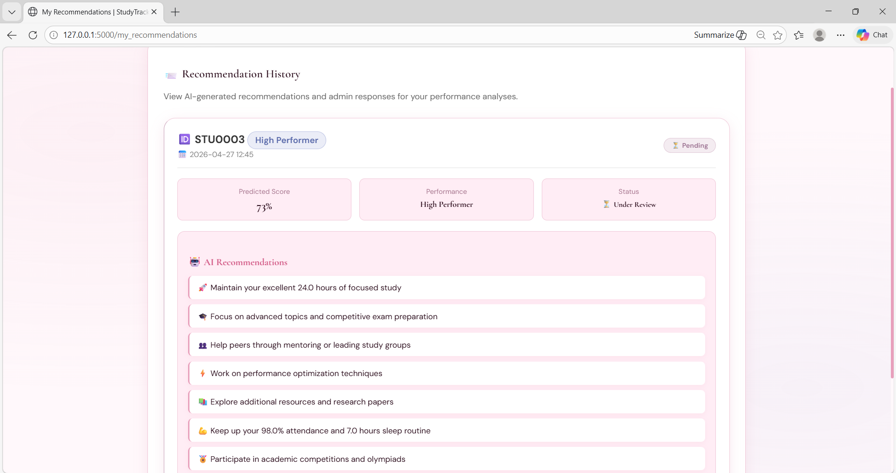
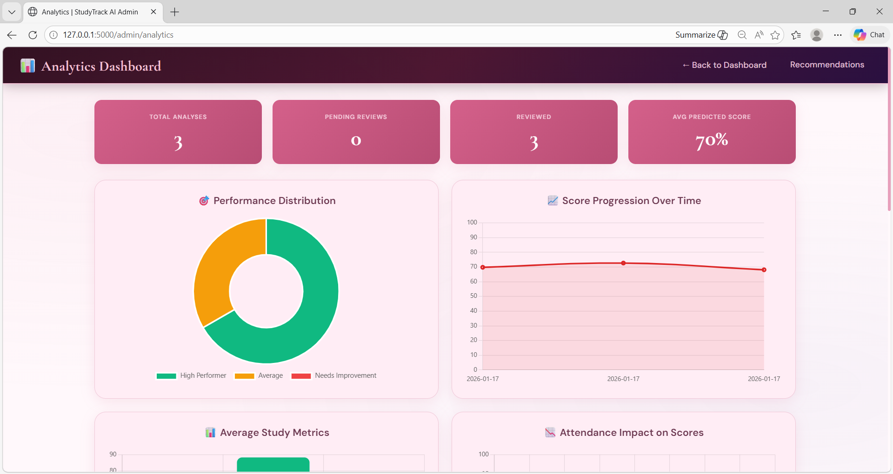

# StudyTrack AI — Student Study Habit Recommender 🎓

<div align="center">


**An AI-powered web application that analyzes student study habits, predicts academic performance using machine learning, and delivers personalized recommendations using the Claude API.**

[Features](#-features) · [Screenshots](#-screenshots) · [Tech Stack](#%EF%B8%8F-tech-stack) · [Setup](#%EF%B8%8F-setup) · [Architecture](#%EF%B8%8F-architecture)

</div>

---

## 🎯 Overview

StudyTrack AI is a full-stack web application built during the **Infosys Springboard Internship 6.0** (Nov 2025 – Jan 2026). It combines machine learning clustering with AI-generated natural language recommendations to help students improve their study habits.

The system supports two roles:
- **Students** — submit their study data, receive AI analysis, view personalized recommendations, track goals, and interact with an AI Coach
- **Admins** — review all student analyses, respond to AI recommendations, and monitor performance analytics across all students

---

## ✨ Features

### Student Side
- 🔍 **Performance Analysis** — Input study hours, attendance, sleep, tutoring, and activity data
- 🤖 **AI Recommendations** — Claude API generates personalized, actionable study tips
- 📈 **Analytics Dashboard** — Score progression, study metrics vs ideal, performance breakdown charts
- 📋 **Recommendation History** — Track all past analyses and admin responses
- 🎯 **Goal Tracking** — Set and monitor personal academic goals
- 💬 **AI Coach** — Chat interface for study guidance

### Admin Side
- 🖥️ **Admin Dashboard** — Overview of all students, pending reviews, and avg predicted scores
- 📊 **Analytics Panel** — Attendance impact scatter plot, review status breakdown, performance distribution
- ✅ **Recommendation Review** — Approve, revise, or respond to AI-generated recommendations
- 🔎 **Student Lookup** — Search and filter by student ID, performance category, or status

---

## 📸 Screenshots

| Home | Student Dashboard | Admin Dashboard |
|------|------------------|-----------------|
|  |  |  |

| Performance Analysis | AI Recommendations | Analytics |
|---------------------|-------------------|-----------|
|  |  |  |

---

## 🛠️ Tech Stack

| Layer | Technology |
|-------|-----------|
| Backend | Python, Flask |
| Database | SQLite (6,600+ student records) |
| Machine Learning | KMeans Clustering (scikit-learn) |
| AI Recommendations | Claude API (Anthropic) |
| Frontend | HTML, CSS, JavaScript |
| Charts | Chart.js |
| Auth | Flask-Login (role-based: Student / Admin) |

---

## 🏗️ Architecture

```
StudyTrack_AI/
├── app.py                        # Flask app entry point
├── studytrack_ai.py              # ML clustering pipeline
├── studytrack_kmeans_model.pkl   # Trained KMeans model
├── studytrack_scaler.pkl         # Fitted StandardScaler
├── studytrack.db                 # SQLite database
├── StudentPerformanceFactors.csv # Dataset
├── requirements.txt              # Python dependencies
├── screenshots/                  # README screenshots
│   ├── home.png
│   ├── student_dashboard.png
│   ├── admin_dashboard.png
│   ├── analysis.png
│   ├── recommendations.png
│   └── analytics.png
├── static/                       # CSS, JS, images
└── templates/                    # HTML templates (Jinja2)
```

---

## ⚙️ Setup

### Prerequisites
- Python 3.10+
- An [Anthropic API key](https://console.anthropic.com/)

### Installation

```bash
# 1. Clone the repo
git clone https://github.com/Vigneshwar1820/StudyTrack_AI.git
cd StudyTrack_AI

# 2. Create a virtual environment
python -m venv venv
source venv/bin/activate        # Windows: venv\Scripts\activate

# 3. Install dependencies
pip install -r requirements.txt

# 4. Set your API key
export ANTHROPIC_API_KEY=your_key_here   # Windows: set ANTHROPIC_API_KEY=your_key_here

# 5. Run the app
python app.py
```

Open `http://127.0.0.1:5000` in your browser.

### Default Credentials

| Role | Username | Password |
|------|----------|----------|
| Admin | admin | admin123 |
| Student | Register via `/register` | — |

---

## 🤖 How the AI Works

1. Student submits study metrics (hours/day, attendance %, sleep hours, tutoring sessions/week, activity hours/week)
2. A **KMeans clustering model** classifies the student as: `High Performer`, `Average Performer`, or `Needs Improvement`
3. The classification + metrics are sent to the **Claude API** with a structured prompt
4. Claude returns 8–10 personalized, actionable recommendations
5. Recommendations are stored and made available for admin review
6. Admin can approve or add custom responses visible to the student

---

## 📊 ML Model

- **Algorithm**: KMeans Clustering
- **Dataset**: 6,607 synthetic student records
- **Features**: Study hours, attendance, sleep, tutoring frequency, extracurricular activity
- **Output**: Performance category + predicted score (%)

---

## 🏆 Internship

This project was built as the mandatory assignment for:

> **Infosys Springboard Internship 6.0**
> *Batch B 8, 9 & 10 | StudyTrack: AI-based Student Study Habit Recommender*
> Nov 24, 2025 – Jan 30, 2026

---

## 📄 License

MIT License — feel free to use and build upon this project.

---

<div align="center">
Made with ❤️ by <a href="https://github.com/Vigneshwar1820">Vigneshwar T</a> · <a href="https://linkedin.com/in/YOUR_LINKEDIN">LinkedIn</a>
</div>
